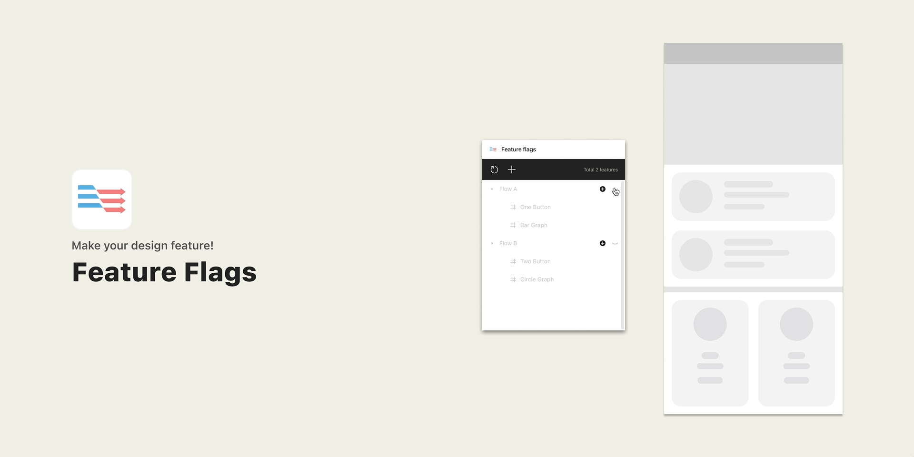

<p align="center">
  
  <br />
  <br />
  
</p>

# Feature Flags

**Feature Flags is a [Figma](https://figma.com/) plugin**


## Architecture

- [Architecture (English)](./ARCHITECTURE.md)
- [아키텍처 설명 (한국어)](./ARCHITECTURE_ko.md)

## Development

```bash
# clone the repo
git clone https://github.com/let-sunny/feature-flags.git

# Install dependencies
npm install

# Start
npm run run
```

## Used tools

- Typescript
- [Custom Element](https://developer.mozilla.org/ko/docs/Web/API/Window/customElements)
- [Mitt](https://github.com/developit/mitt)
- Webpack
- Jest

## Roadmap

- [ ] Share the features among users
- [ ] Drag and drop for moving between features of a node
